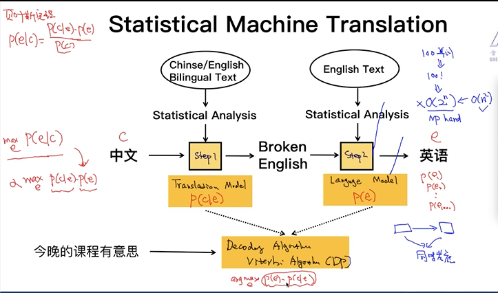
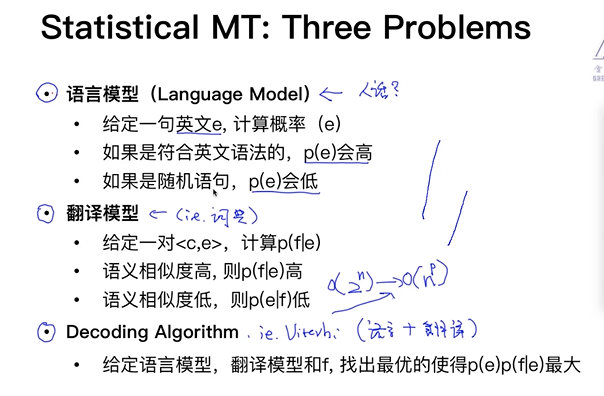
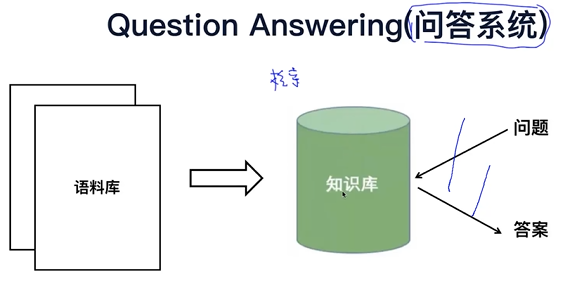
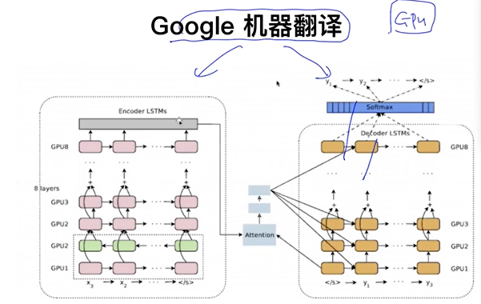
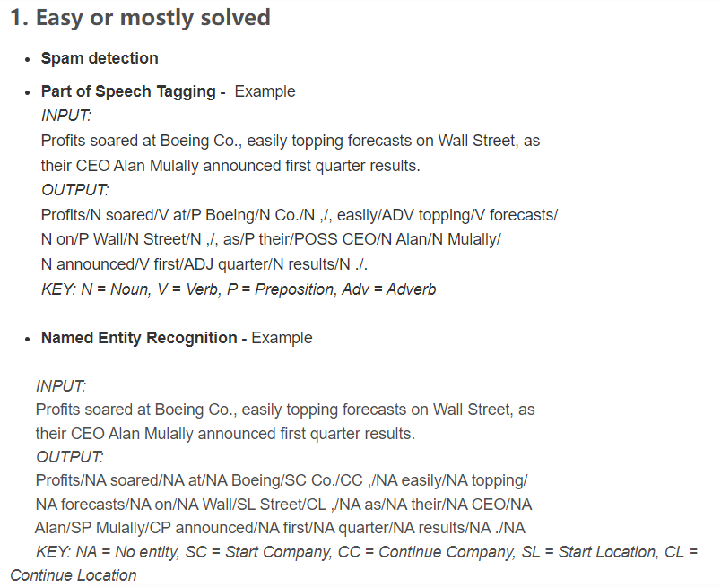
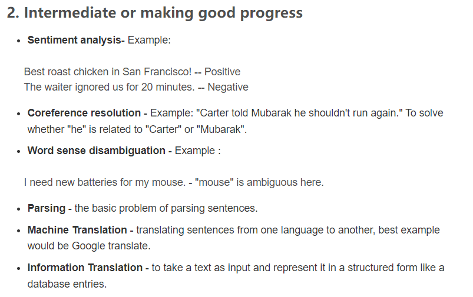
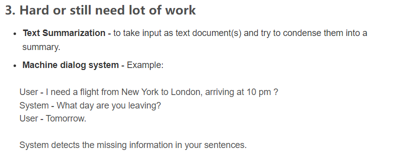

# What is NLP?      
* NLP = NLU + NLG     
    * NLU: Natural Language Understand。 語音/文本 > 意思    
    * NLG: Natural Language Generation。 意思 > 語音/文本    
* The challenage: 
    * multiple ways to express(一義多表)      
    * ambiguity(一詞多義)       

:speech_balloon: 看了上下文(context), 可更新認知    

## Case study: 機器翻譯系統(machine translation)       
* statistical machine translation: 中翻成broken english, 再窮盡所有排列組合, 由language model評分, 得到最合適的句子.  
    * *translation model*: 中翻成broken english     
    * *language model*: 評分, 得到最合適的句子.     
    * 分開考慮是為np hard problem, 故同時考慮兩問題, *decoding algorithm* (viterbi algorithm, Dynamic programming-DP), 給定中文下, 翻譯為此英文的機率.         
     
     

# application: 
1. question answering 問答系統     
    
基於使用場景, 建立F&Q- 法律的知識圖譜...       

2. sentiment analysis 情感分析
     

3. machine translation 機器翻譯
     
使用gpu,    
需要大量文本, 分布式集群才能訓練出頂好的效果      

4. text summarization 自動摘要      
5. chatbot 聊天機器人
無聊了, 隨便聊一聊          
想定一個機票        
不知道自己要作甚麼      

6. information extration 信息抽取   
78成需要此技術, 包括爬蟲 也需要     
在怎樣的文本中提取關鍵事件      

# NLP 技術四維度    
semantic(語意), symantic(句子結構), morphology(單詞), phonetics(聲音)   
* 單詞: 分詞, POS-詞性, :star: NER-named entity recognition命名實體識別(搭建文字圖譜, 問答系統會用到)    
* 句子結構: 句法分析, 依存分析-單詞間的關係   
* 語意: NLU, 透過機器學習算法, 如情緒分析     
  
知識圖譜可將不同數據源串起來, 並給予很直觀的展示    
transformer? goggle translator has used deep learning   
parsing(句法分析): CYK, 使用到dynamic programming(動態規劃)
dependency parcing(依存分析): 

# What are the major open problems in natural language understanding?   
     
     
     
