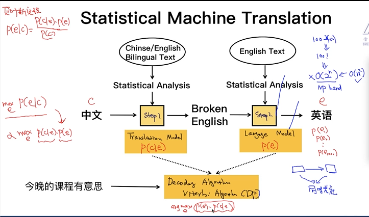

# What is NLP?      
* NLP = NLU + NLG     
    * NLU: Natural Language Understand。 語音/文本 > 意思    
    * NLG: Natural Language Generation。 意思 > 語音/文本    
* The challenage: 
    * multiple ways to express(一義多表)      
    * ambiguity(一詞多義)       

:speech_balloon: 看了上下文(context), 可更新認知    

## Case study: 機器翻譯系統(machine translation)       
* statistical machine translation: 中翻成broken english, 再窮盡所有排列組合, 由language model評分, 得到最合適的句子.  
    * *translation model*: 中翻成broken english     
    * *language model*: 評分, 得到最合適的句子.     
    * 分開考慮是為np hard problem, 故同時考慮兩問題, *decoding algorithm* (viterbi algorithm, Dynamic programming-DP), 給定中文下, 翻譯為此英文的機率.         
     
     

