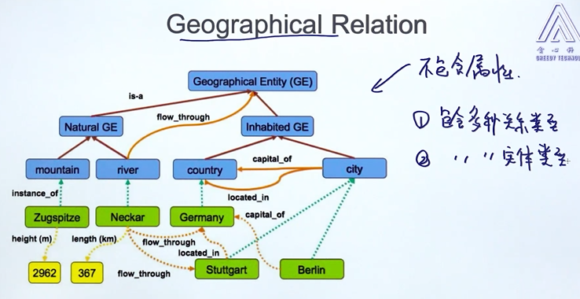

# 15 信息抽取 imformation extraction       

     

# 1. 基礎: NER- 命名實體識別     

* extract information from unstructured text, like image, text, video, audio, 需進一步處理為feature, 在作成model, 或轉成 structured data.     
    * 抽取實體(entities): 不同領域看重的entity不同, person, location, time...      
    * 抽取關係(relations): located in, work at, in part of          (may use 文字圖譜)      
    * 關係消解      
    * 實體消歧, 實體統一        

* application of NER in corp: alphasense, diffbot, palantir...    
    - 資料庫的搭建  
    - Google Scholar, CiteSeerX     
    - 用戶庫: Rapleaf, Spoke    
    - 購物引擎, 產品搜索    
    - 專利分析  
    - 證券分析      
    - 問答系統      

## Search Eegine & Question Answering    
QA-level1: 返回以準備好的答案, 文檔一       
QA-level2: 返回關鍵句子, sentence extraction        
QA-level3: 返回long-phase, 貪心科技成立於2018年       
QA-level4: 返回entity, 2018       
> 返回越詳細, 容錯率越低      


# 2. Named Entity Recognition 命名實體識別, 專名識別          
識別文本中具有特殊意義的實體, 主要包括人名、地名、專有名詞...       

* Case1: Chatbot  
    * alicebot 2004      
    > 識別意圖, dialogue rule(基於規則)     
    slots包含 目的地, 出發地, 時間...獲取後發送API, 再NLG(natural language generation)回答句子.     

    > 在工業界應用, 首先通過規則, 如果不行再加模型, 彌補規則的缺點.     

* Case2: Extract from News    
    * 提取entity-> 抽取關係-> NLG
    (bosonnlp.com/demo)     
    English toolkits: NLTK NE, Spacy, Stanford Parser       
    Chinese toolkit: HanNLP, HIT NLP, Fudan NLP...      

* Case3: Resume Analysis     


```py
# NER_intro.ipynb   

paragraph1 = ""
paragraph2 = "Beijing, Shanghai, Tianjin"


import nltk

print('NTLK version: %s' % (nltk.__version__))

from nltk import word_tokenize, pos_tag, ne_chunk

nltk.download('words')
nltk.download('averaged_perceptron_tagger')
nltk.download('punkt')
nltk.download('maxent_ne_chunker')


results = ne_chunk(pos_tag(word_tokenize(paragraph1)))
print('The sentence is : %s' % (paragraph1)) 
print()
for x in str(results).split('\n'):
    if '/NNP' in x:
        print(x)        

results = ne_chunk(pos_tag(word_tokenize(paragraph2)))
print(paragraph2)
print()
for x in str(results).split('\n'):
    if '/NNP' in x:
        print(x)
```

## Create NER Recognizer
* 定義實體種類: Begin & Inner      
* 準備訓練數據      
* 訓練NER-  evaluate NER recognizer: precision/recall, F1-score     

## Method of NER    
* 利用規則 (ex.正則)    
* 投票模型 (Majority Voting)        
* 利用分類模型
    * 非時序模型: 邏輯回歸, SVM     
    * 時序模型: HMM, CRF, LSTM-CRF      

1. Rule-based approach      
美國電話: ` (?:\(?[0-9]{3}[-.]?[0-9]{4} `   
利用已定義的辭典: if token.contains(word) and word in xxx(詞庫)     

2. Majority Voting  
統計每個單詞的實體類型, 紀錄針對於每個單詞, 機率最大的實體類型  

> Method1_Majority_Voting.ipnb   

```py
from sklearn.base import BaseEstimator, TransformerMixin

class MajorityVotingTagger(BaseEstimator, TransformerMixin):
    ...
```
3. Simple Feature Engineering for Supervised    
提取每個單詞的最簡單特徵, 如單詞長度...         
* entity: pos1, pos2, pos3 -> :star: feature vector -> model -> result     
    * bag-of-word features:     
    當前詞: colin   
    前後詞: profession, proposed    
    前前後後: the, model    
    bi-gram: profession colin, colin proposed, the professor, proposed model    
    tri-gram: ...  

    * 詞性- feature     
    當前詞: n.  
    前後詞: n. v.       
    前前後後: 冠詞, n.  
    
    * 前綴&後綴     
    當前詞: co, in
    前後詞: pr, or, pr, ed  
    前前後後: 

    * 當前詞的特性  
    ex. 詞長, 含有幾個大寫字母, 是否為大寫開頭, 是否包含 "-", 當前詞是否為大寫, 是否包含數字...         

    * stemming 重複特徵     


4. feature encoding    
* 當前詞的詞性: loc -> one-hot encoding   
* 常見的特徵種類:     
    * 類別型特徵 categorical feature    
    * 連續型特徵 continue feature   
    * 有序型特徵 ordinal feature


## 3. Information Extraction 信息抽取        
* 問答系統      
* 擴充原有的知識庫 (knowledge base)      
* 最需要的領域: 法律, 金融(客戶訊息, 網路文本數據)...   

將常用的entity作分類
ex. wikipedia (文本-> 關鍵結構性訊息)..             
     
geographical relation 文字圖譜  
     
