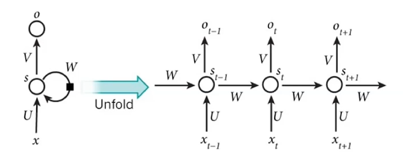
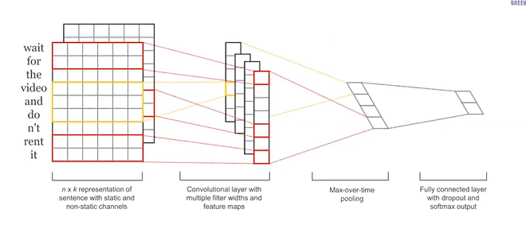

Ontological Relation    
Relation extraction     

# 1. Ontological Relation      

IS-A (hypernym relation)        
Instance-of     

### :notes: Open source knowledge base      
* FreeBase      
* WorldNet      
* Yago      
* Dpedia        
* KnowledgeVault (from google)        

# 2. Relation extraction   
* 基於規則        
* 監督學習 - 通過分類模型確認有甚麼關係          
* 半監督 & 無監督學習   
    * bootstrap     
    * distant supervision (wordNet, BaseNet)  
    * 無監督學習    

1. 基於規則 rule-based method           
extracting "is-a"       
List rule base: X is a Y, Y such as X, Y including X, Y especially X     
優: 比較準確, 不用訓練數據      
缺: low recall rate (覆蓋範圍低), 人力成本高, 規則本身難設計             

2. 基於監督式學習 supervised learning for relation extraction       
- 定義關係類型      
- 定義實體類型      
- 訓練數據準備      
    - 實體標注好(類型)      
    - 實體間的關係      

feature engineering     
- bag-of-word feature       
- pos feature       
- 實體類別: OGR, PER...     
- Stemming      
- 位置相關訊息: 兩個實體間包含了多少個單詞? 這句話在本文的位置?              
- 句法分析相關特徵: 兩節點間的shortest path, 經過了甚麼東西           
- 依存文法相關特徵: 關係的方向, 只看依賴關係          

-> 特徵 -> model1: 有關係, 無關係 -> model2: 分類1, 分類2...分類k     

# :notes: 常見的特徵提取器      
RNN, CNN, transformer       

### 1. 特徵提取器-RNN   
     
RSTM,       
* 一個單元, 不斷進入循環與輸出, 第一個時間的輸入, 有時輸出有時不輸出, 再進入下一個節點, 進行運算, 
* 優: 對於不同長度, 可以透過編碼轉成相同長度      
* 缺: 若語句長, 容易造成梯度消失    

### 2. 特徵提取器-CNN  
     
過去常用於圖像領域, 用於NLP, 仍看作圖像來計算       
接多個卷積, 將不同特徵抽取出更多的抽象特徵
1 * 9 -> 1 * 9 * 100

next: 203       