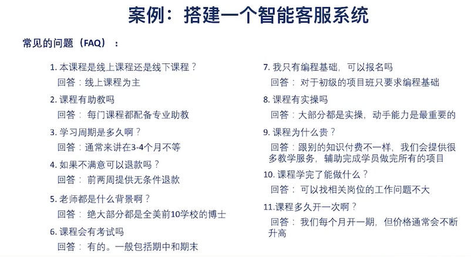

# 算法複雜度        

```python

def compute(a,b):
    n, s = 10, 0
    for i in range(n):  
        for j in range(n):  
            s = s + a * b
    return s

# 時間複雜度 O(n), 空間複雜度 O(1)  

```

* sorting: merge sort (歸併排序)    
    * divide and conquer    
* Master theorem (主定理方法)    
    * fibonanci number      

延伸閱讀:   
[NLPCamp] 時間複雜度與空間複雜度-算法工程師不可忽略的重要指標       
https://zhuanlan.zhihu.com/p/53286463   


# 問答系統介紹      
     
用 語料庫(knowledge base) 來搭建一個智能客服系統.     

* 根據 用戶輸入 和 語料庫的問題 *相似度*, 判斷是問哪一問題, 與該回覆甚麼答案. 
相似度: 正則 or 字府串相似      

將文本轉為向量.     
sentence -> segmentation(分詞)  
-> 預處理 (spell correclation, stemming/lemmatization, stop-words, words filter, 同義詞...)       
-> 文本向量表示 (boolean vector, context vector, tf-idf, word2vector, seq2seq...)   
-> 計算相似度, 給定兩個向量 (euclidean distance, cosine distance, Jaccard similarity...)    
-> 相似度排序 -> 過濾 -> 返回結果       

      
* 問答系統 現存方法: 文本表示, 相似度    
* 知識圖譜: 實體抽取, 關係抽取    


# 延伸學習:       
按問題找答案    
（数据结构）十分钟搞定时间复杂度（算法的时间复杂度）    https://www.jianshu.com/p/f4cca5ce055a   
Dynamic Programming - Edit Distance Problem            
https://tutorialhorizon.com/algorithms/dynamic-programming-edit-distance-problem/       
Master Theorem:
Practice Problems and Solutions     
http://people.csail.mit.edu/thies/6.046-web/master.pdf      


# Review: 心理學與DL, RL: 一隻狗和兩隻貓的故事      

源自 認知心理學, 強化學習, 視覺機制     
巴普洛夫的狗 (條件反射)    
華生的行為主義 (連結主義)     
強化學習(正強化, 負強化, 正懲罰, 負懲罰)    
hubel and wiesel的貓    


