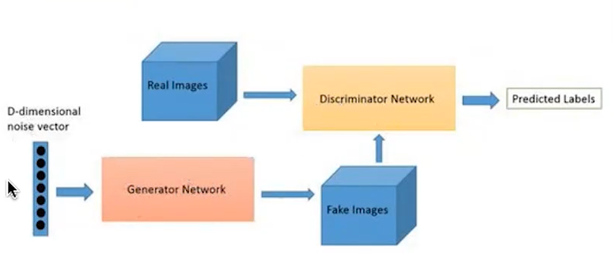
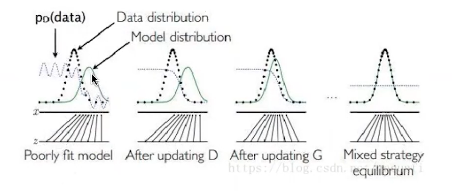
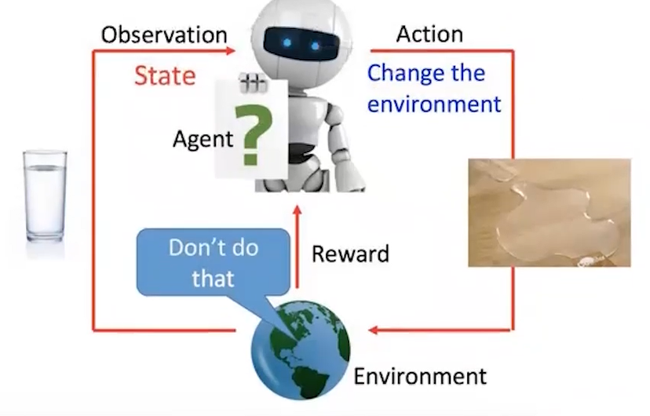
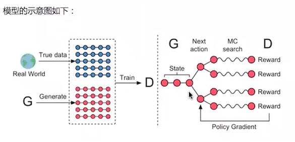

# 基於GAN及強化學習的文本生成       

## seqGAN   
     
鑑別器discriminator 隨機初始化, 不知道真實數據與假數據的差異. 僅是靠兩模型交替訓練, 兩者間的共同提升, 直到generator生成器達到一定效果.    
博弈論的Nash均衡, 希望達到判別結果為0.5, 不知道生成器生成的檔案是真的還是假的,      
     
一開始鑑別器鑑別能力很差,       
交替訓練兩模型, 先固定生成器, 優化判別模型.             
慢慢的, 生成器生成的數據越來越趨近於真實數據的樣本分布,         
最後近似於真實樣本, 所以鑑別器無法分辨是否為真實樣本, 判別正確率維持於0.5           

## 強化學習      
     
environment；agent: 所要訓練的機器       
environment提供狀態, 讓agent可以反應. agent做了某件事, agent改變環境, env給一個反饋(reward), 好的或不好的, 讓agent可以學到下次該如何變, 才能得到正反饋.          

policy-based(obj is learning an actor行為) or       
value-based (obj is learning a critic評價策略) or both involed
* 蒙地卡羅搜索    

     

> https://github.com/u8u8jiang/SeqGAN_tensorflow #334

