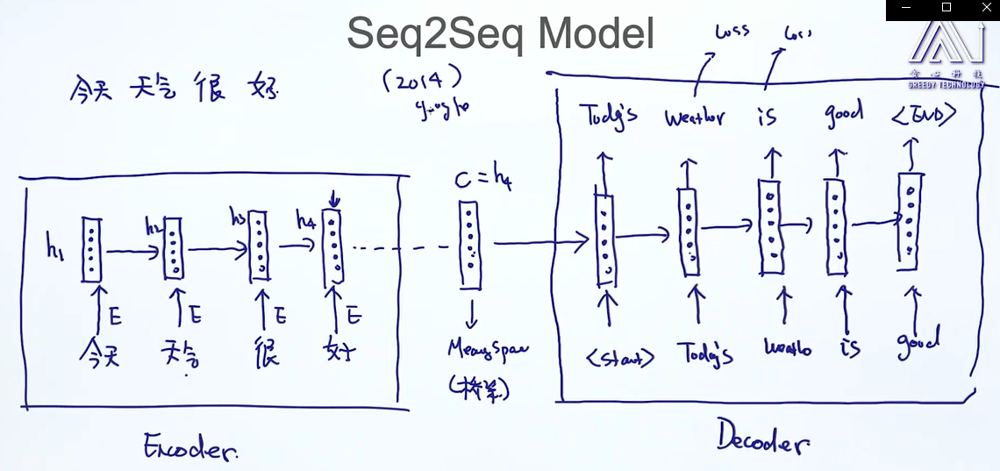

# Seq2seq       

* neural machine translation (端到端的)機器翻譯 
英翻中時, 因不是按順序翻譯, so as sequential alegment   
* multimodel learning     

* RNN/LSTM: 表time series data    
a. CNN(image) -> RNN/LSTM(text), image capturing, attention機制         
RNN/LSTM(text) -> CNN(image)        
b. RNN/LSTM -> RNN/LSTM     
中翻英, 文本轉代碼, 代碼轉文本(git message commit), speech to text, text to audio signal                  

相似意思的不同語言, 映射到同一個meaning space.      
     
inference & decoding        

