Seq2seq     
word2vec    
Graph-embedding     
單語意文本匹配, 多語意文檔表達      

# Seq2seq #324-325      

* neural machine translation (端到端的)機器翻譯 
英翻中時, 因不是按順序翻譯, so as sequential alegment   
* multimodel learning     

* RNN/LSTM: 表time series data    
a. CNN(image) -> RNN/LSTM(text), image capturing, attention機制         
RNN/LSTM(text) -> CNN(image)        
b. RNN/LSTM -> RNN/LSTM     
中翻英, 文本轉代碼, 代碼轉文本(git message commit), speech to text, text to audio signal                  

相似意思的不同語言, 映射到同一個meaning space.      
     
inference & decoding        
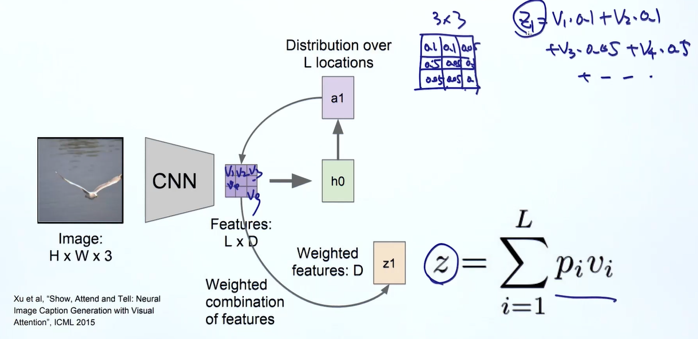 
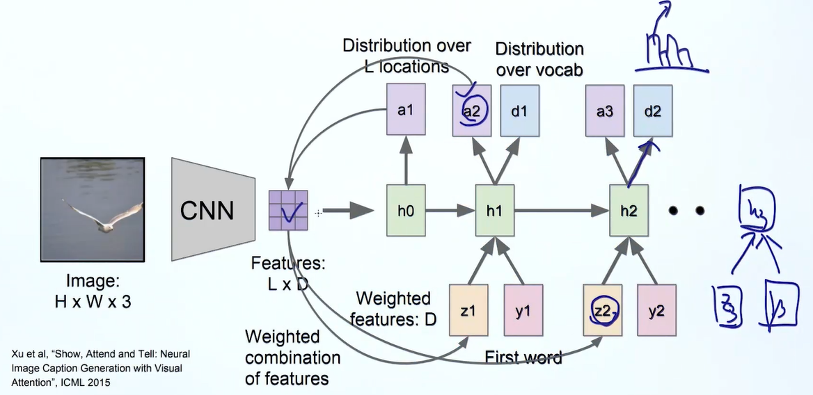 

# word2vec  #402        
word2vec是指 當有篇自然語言的文章, 其上下文可以預測中心詞, 也可以用中心詞預測上下文. 透過這樣的預測任務, 藉此判斷中心詞與上下文的關係. 或著訓練到後面, 每個詞皆為一個向量.      
由於我們的訓練任務, 讓每個詞都對上下文進行預測. 每個詞對上下文進行修改, 當遇到相似的上下文, 彼此向量自然會離得比較近.            

比如說訓練方式有兩種, 用上下文預測中心詞-CBOW, 用中心詞預測上下文-Skip-Gram     
得到的結果可以做運算, 識別這樣的關係, 且透過一個數學式作表示    
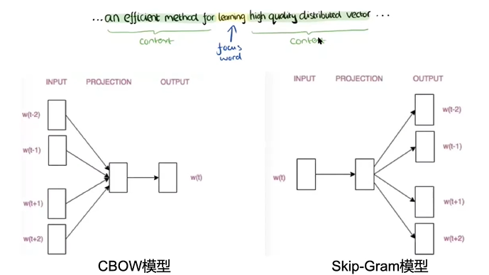     

# Graph-embedding (embedding在graph上的突破)  #402        
所有東西皆可embedding(embedding everything), 只要可以表示成上下文型式, 包括這種上下文節點. ex. knowledge graph, 將資訊存在圖中,           
可以進行顯示的推理, 因為邊之間是有關係的, 節點是有意義的, 此為圖的存儲.   
可以取得統計訊息, 如節點的間隔距離, 出度, 入度..., 就像是可以使用tf-idf的語言特徵, 但無法擷取到語意的訊息. 如何衡量節點間的相似度, 可以將graph embedding為一個向量. 可以透過sin, cos衡量其相似程度.                
路徑在點之間遊走, 可以看作word2vec的上下文, 將上下文透過word2vec作訓練, 便可得到節點之間的向量, 用簡單的矩陣運算, 便可衡量兩點間的相似度.     

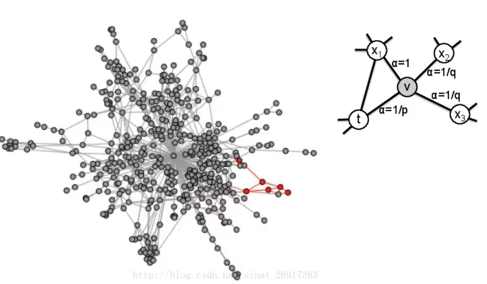    
airbnb- item2vec相似物推薦, end-to-end         

# 單語意文本匹配, 多語意文檔表達  #339-340        
關鍵字搜索, FAQ, 語言翻譯 文本複述...               

### 1. 單語意文本匹配    
將兩句待匹配的句子進行編碼及特徵抽取, 成兩個乾淨的向量, 再作分類或回歸 得到score. 後面...模型多是針對特徵提取模塊複雜化, 用不同方式作拼接.                       
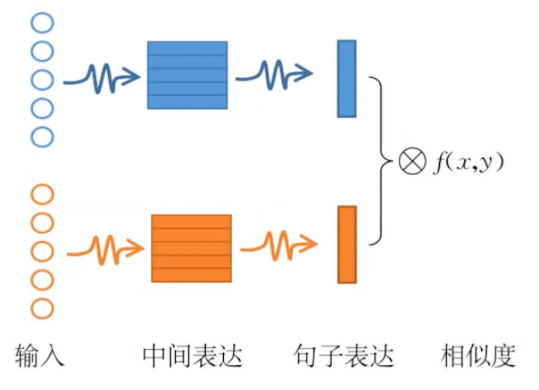
內積-相似度計算     
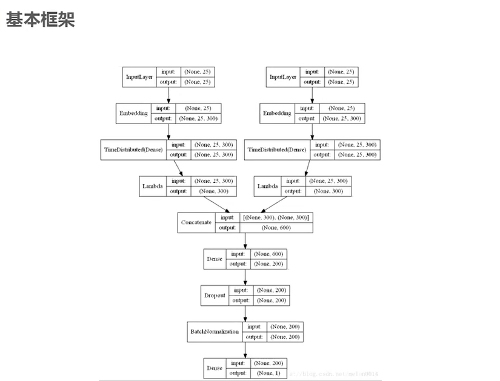        

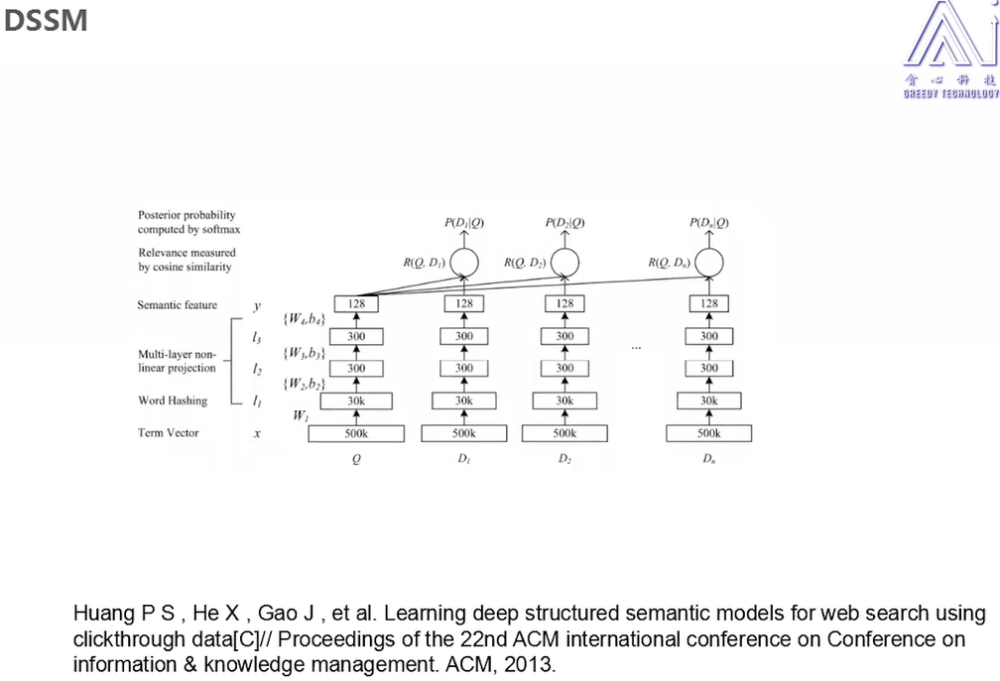        
DSSM-用神經網路作文本匹配, 訓練和測試,         
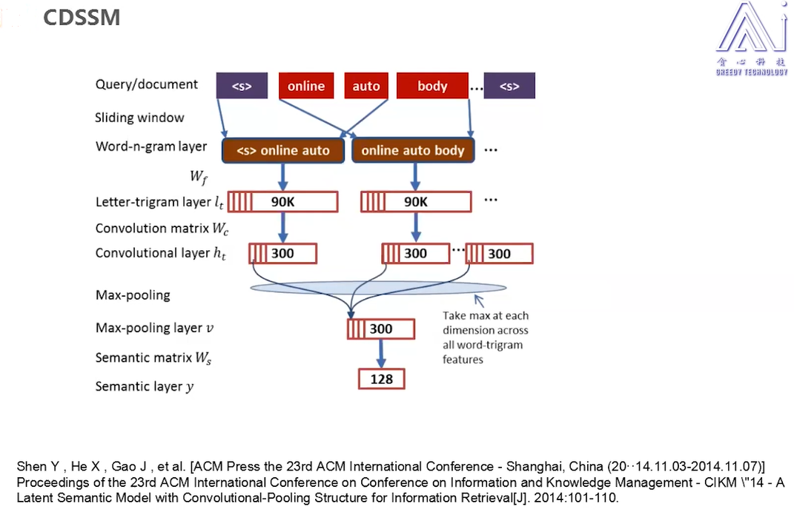  
CDSSM-全連接層不能方便得到所有上下文訊息, 且參數量大, 故透過卷積替代全連接層.    
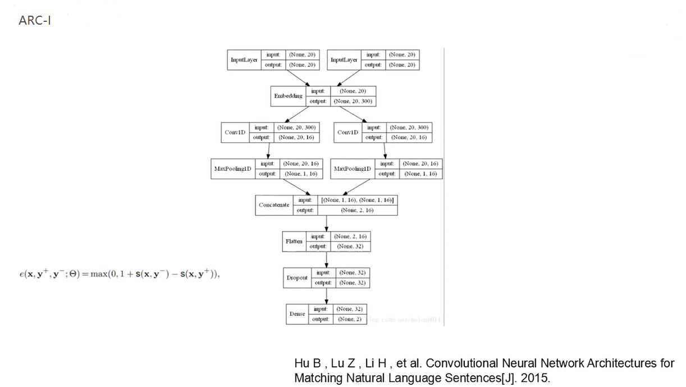  
ARC-I: 與CDSSM相似, 透過卷積提取特徵, concate後...      

### 2. 多語意文檔表達           

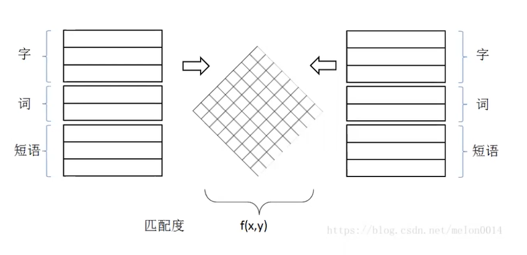  
左右為待匹配的句子, 從這兩句子中取出不同力度的特徵, 提完特徵變成向量前, 對這兩方塊進行融合交叉運算,   
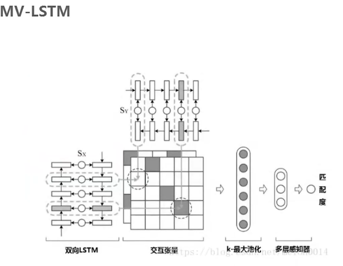  
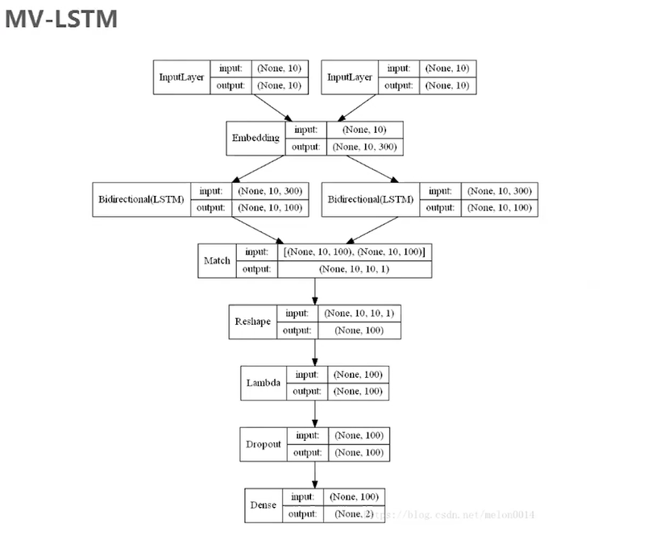    
MV-LSTM: 主要透過LSTM實現, 

others: matchpyramid        

