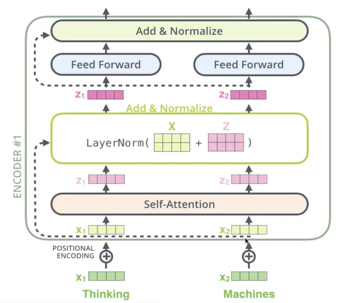
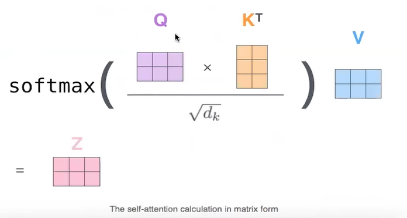

# transformer  
     
是一個深度學習模型, 無論是encoder還是decoder都有深度.       
encoder和decoder主要有兩點不同: (1) encoder-decoder attention, (2) self-attention中的結構不同       

### key:        
* how does Transformer implement long-term dependency? (to replace LSTM time dependency)             
* how does self-attention, encoder-decoder attention, decoder attention differs?        
* how does Transformer encoder different ordering of words      

> greedy_decoder https://github.com/graykode/nlp-tutorial/blob/master/5-1.Transformer/Transformer(Greedy_decoder).py 

     

* self-attention      
attention is all you need       

* add nomalization              

     

     

# BERT: pre-training og deep bidirectional transformers for language understanding      

1. pretraining embedding:       
A. Word2Vec (skip-gram, glove)      
B. Contextualized Representation    
learn contextualized embedding      
A. language modeling, LSTM +    unsupervised data       
    lots of data -> unsupervised data -> fine tuning      

2. fine-tuning     
application in 情感分析     

3. language model   
adventage: 生成下一個單詞   
but 目的是: 學習最好的表示法(上下文)        

4. bi-directional LM: 訓練多個LSTM        

# attention, transformer, bert #176-177     
vituralizing a neural machine translation model     
(mechanics of Seq2seq models models with attention)     

## 1. attention: 只能看其中一個點, ex花瓶人臉         

     
     

* seq2seq,    
* encoder and decoder 使用循環神經系統, 如果encoder效果不好, 則decoder效果也會不好. 在decoder中加入attention機制, 也許可以提升長句翻譯的效果.     
* 如將法語翻成中文...   

## 2. transformer             
https://jalammar.github.io/illustrated-transformer/     

* 與attention一樣, 也是有一組encoder, decoder, 如圖各是由6個encoder和6個decoder組成, encoder與decoder的對應關係是固定的         
     
     

### Encoder          

* 對於每個encoder是一個self-attention層, 都有一個全連接網絡, 而decoder比encoder多了 "encoder-decoder attention"          
* 輸入encoder的方式是一個一個字母解碼, 跟循環神經網絡不一樣的是, 對於單個字元都是可以獨立流進後方的. 無先後計算關係, 算力較快. 注意不同詞    
     
     

* self-attention的矩陣運算 (WQ, WK, WV): 不僅結合單詞的訊息, 也結合了單詞與單詞間的訊息.          
* 沒有兼顧到順序, 乘上表位置的層 20*512, 就取那個位置的數字。加回原數值        
     
     
         

### Decoder     

         

缺點是: decoder僅針對前一個單詞進行編碼, 所以說僅是單向編碼, 涉及上文編碼, 而沒有下文編碼, 對翻譯有影響.   
而BERT是雙向編碼, 是為雙向的transformer     

## 3. BERT
https://jalammar.github.io/illustrated-bert/

BERT是一個預訓練模型, 半監督式學習 vs 監督式學習(垃圾郵件分類)     
    
         

官方有兩個BERT版本, BERTbase(12 layers encoder) & BERTlarge(24 layers encoder)    
與transformer差異在encoder, 讓編碼可以擷取到上下文訊息.     
針對15%數據作遮蓋(masked), 將10%更換乘隨機單詞, 10%無替換, 增強隨機性noise      
masked-> 完形填空, 預測上下文       
## application:      

特徵提取, 將不同提取層作排列組合, 疊合的效果是最佳的                             
             
             

