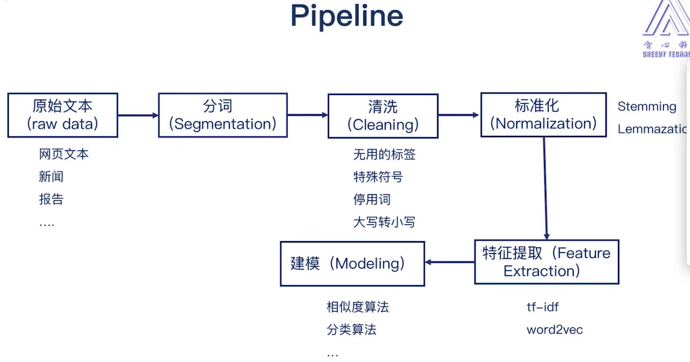
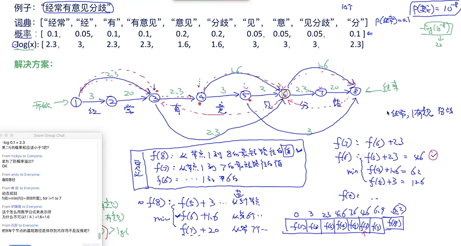

#### 内容包括:
- 分词 word segmentation    
- 拼写纠错 spell correction     
- 停用词过滤 stop words removal     
- 词的标准化 stemming   

NLP項目流程:    
     


* 原始文本: 網頁文本, 新聞, 報告...
* 分詞: 英文/中文
* 清洗:
    * 無用的標籤 <html>     
    * 特殊符號 
    * 停用詞 stop-word, a, an, the
    * 大寫轉小寫    
* 標準化 (字符串)- 將多個詞合成為一個詞的過程, 如 go, gone, going 映射成 go.                 
    * stemming  
    * lemmazation    
* 特徵提取 (向量)- 轉換成特徵   
    * tf-idf    
    * word2vec  
* 建模- AI算法      
    * 相似度算法    
    * 分類算法      
* 評估      

# 分词 word segmentation   

## Word segmentation tools   
jieba分詞 https://github.com/fxsjy/jieba
SnowNLP https://github.com/isnowfy/snownlp
LTP  https://www.ltp-cloud.com/
HanLP  https://github.com/hankcs/HanLP/
...


```py
import jieba    

seg_list = jieba.cut("貪心學院專注於人工智能教育", cut_all=False)
print("Default Mode: " + "/".join(seg_list))

jieba.add_word("貪心學院")
seg_list = jieba.cut("貪心學院專注於人工智能教育", cut_all=False)
print("Default Mode: " + "/".join(seg_list))

```

* segmentation method1: max matching      
    * forward-max matching(前向最大匹配)      
    * backward-max matching(後向最大匹配)     

    功能:   
    - 細分(有可能更好)    
    - 局部最優    
    - 效率(max-lew)   
    - 歧異(不能考慮語義, 僅能考慮單詞)    

* segmentation method2: incorporate semantic (考慮語義)     
先生成可能的分割, 選取其中最好的, 生成language model      

```py

# project1 
# :star: 047: lesson6直播.mp4 前20分鐘  

# 分數 (10)     
## TODO 請編寫word_segment_naive 函數實現輸入字符串的分詞   

def word_segment_naive(input_str):
    """
    1. 對於輸入字符串做分詞, 並返回所有可行的分詞後的結果
    2. 針對每一個返回結果, 計算句子的機率
    3. 返回機率最高的作為最後結果
    """

    # todo : step1 計算所有可能的分詞結果

    # todo : step2 選擇最好的   

```
維特比算法: 合併兩步驟, 解決效率問題    
給訂最早的圖, 計算最短路徑

     


# Some interesting problems to consider     
- logical inference 邏輯推理
- conflict resolution 解決規則衝突      
- minimum size of rules 選擇最小規則的子集      

step1. 找類似結果的問題     
step2. 讀paper (about set cover problem)    
