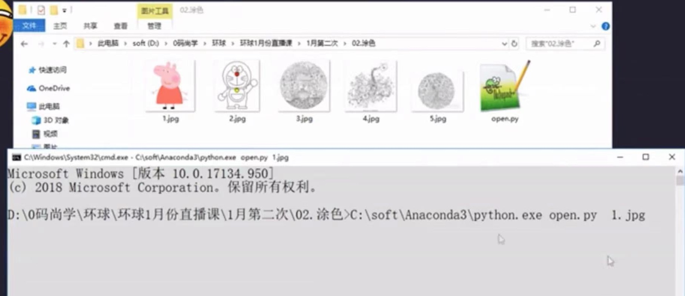

隨便找的python基礎教程, 有讓我意外到, 他執行python 教本的方式有讓我驚艷到。原來在cmd上是這樣執行的, 好像了解instagram-scraper是怎麼執行的了, 改天來試試看~(2023/04/21)         

# 著色        
1.py                
     

# 生成音樂    
* 2.py                
    * install midiutil        
    * pip install midiutil (under cmd)                 
    * python main.py      

# 打遊戲        
* 3.py        
    * install pygame      
    * pip install pygame (under cmd)            
    * python 3.py     

# 爬蟲      
* 4-1.py      #以bs4抓取web data        
* you-get https://www.bilibili.com/video/av82879702?spm_id_from=333.851.b_7265706f7274466972737431.8      
* 4-2.py      #tushare 

看著python道路上, 還有數據分析, 大數據, 機器學習, 人工智能, 我對未來充滿期待.       

# BIG DATA          
平台搭建/優化/運維/監控, 大數據開發/設計/架構, 數據分析/挖掘               
开源的大数据框架：              
* 文件存儲：Hadoop HDFS, Tachvon, KFS       
* 離線计算：Hadoop MapReduce, Spark  
* 流式、實時計算：Storm, Spark Streaming, S4, Heron             
* K-V, NoSQL數據庫：HBase, Redis, MongoDB       
* 资源管理：YARN, Mesos
* 日志收集：Flume, Scribe, Logstash, Kibana
* 消息系统：Kafka, StormMQ, ZeroMQ, RabbitMQ
* 查询分析：Hive, lmpala, Pig, Presto, Phoenix, SparkSQL, Drill, Flink, Kylin, Druid            
* 分布式協調服務：Zookeeper         
* 集群管理与监控：Ambari, Ganglia, Nagios, Cloudera Manager     
* 数据挖掘、机器学习：Mahout、Spark MLLib       
* 数据同步：Sqoop       
* 任务调度：Oozie       

# 方向: 开发/设计/架构  from代碼丸子          
第一章：初识Hadoop      
1.1 学会百度与Google：不论遇到什么问题，先试试搜索并自己解决。          
1.2 参考资料首选官方文档        
1.3 先讓Hadoop跑起来：大多开源的大数据框架都依赖Hadoop或者与它能很好的兼容。        
自己搭建Hadoop，请使用第一步和第二步。建议先使用安装包命令行安装，不要使用管理工具安装。另外Hadoop1.0知道它就行了，现在都用Hadoop2.0.         
至少先搞清楚以下是什么：
* Hadoop 1.0, Hadoop 2.0         
* MapReduce, HDFS            
* NameNode, DataNode              
* JobTracker, TaskTracker
* Yarn, ResourceManager, NodeManager      

1.4 试试使用Hadoop：HDFS目录操作命令;上传、下載文件命令；提交運行MapReduce範例程式, 打開hadoop WEB介面

#   大平台      
端(各種安全設備, 傳感器, 工控設備, 應用)        
邊(邊緣計算, 網關)          
雲(雲平台, docker, mesos, 管理平台, 運維平台)       
網(網路通訊, kafka, HTTP, MQTT)     
智(人工智慧分析, 如異常檢測, 關聯分析, 圖形分析)            

公有雲: 雲計算, 區塊鍊, 流程雲, 物聯網雲平台, 移動雲平台, 容器雲, 集成雲, API網關, 微服務...         

