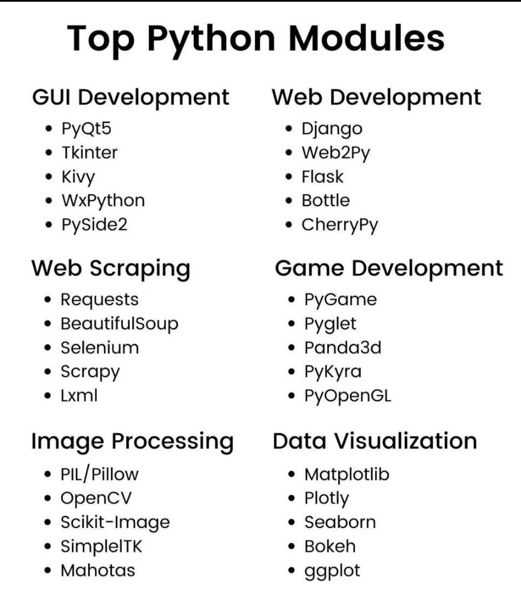

 


### Python直譯器
```py
type()           # 資料型態
x = 10           # 變數

# list清單
a = [1,2,3,4,5]  
print(a[0:2])
print(a[1:])
print(a[:3])
print(a[:-1])
print(a[:-2])  


# 字典型態
me = { 'height':180 }   
me['height']
me['weight'] = 70  #新增
print(me)   


# bol布林型態
hungry = True
sleepy = False
print(type(hungry))
print(not hungry)
print(hungry and sleepy)
print(hungry or sleepy)


# if陳述式
hungry = True
if hungry:
    print("I'm hungry")

hungry = False
if hungry:
    print("I'm hungry")
else:
    print("I'm hungry")
    print("I'm sleepy")


# for陳述式
for i in [1,2,3]:
    print(i)

# 函數
def hello(object):
    print("Hello "+ object + "!")

hello("jill")

```

### Python Script

```py
# class類別

# 嵌入式資料型態, 如int, str等資料型態, 一開始便已嵌入於python中, 
# 自定義類別class, 建立新資料型態

class greet:
    def __init__(self, name):
        self.name = name
        
    def hello(self):
        print("Hello "+ self.name + "!")

    def goodbye(self):
        print("Goodbye "+ self.name + "!")

greet = greet("Jill")
greet.hello()
greet.goodbye()

```

### Numpy array

```py

import numpy as np


# 算術運算
x = np.array([1.0, 2.0, 3.0])
y = np.array([2.0, 4.0, 6.0])
print(x+y)
print(x-y)
print(x*y)    #element-wise product
print(x/y)
print(x/2.0)  #broadcast

# N維陣列
A = np.array([[1,2],[3,4]])
B = np.array([[3,0],[0,6]])
print(A+B)
print(A*B)
print(A*10)


# 存取元素
X = np.array([[51,55],[14,19],[0,4]])
print(X)
print(X[0])
print(X[0][1])

X = X.flatten()
print(X)
print(X[np.array([0,2,4])])   #取第0,2,4個元素

print(X>15)
print(X[X>15])         #取符合條件的值

```

### Matplot

```py

import numpy as np
import matplotlib.pyplot as plt


# 繪製單純圖表
x = np.anange(0, 6, 0.1)
y = np.sin(x)

plt.plot(x,y)
plt.show()

# pyplot function
x = np.arange(0, 6, 0.1)
y1 = np.sin()
y2 = np.cos()

plt.plot(x, y1, label="sin" )
plt.plot(x, y2, linestyle="--", label="cos" )   #虛線
plt.xlabel("x")
plt.ylabel("y")
plt.title("sin & cos")
plt.legend()
plt.show


# 


```


 
 
