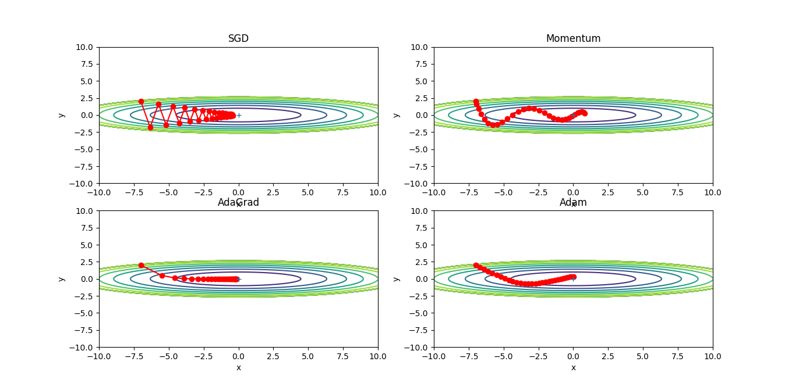
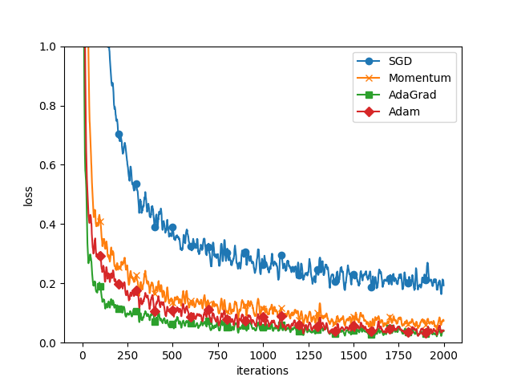

## ch6 與學習有關的技巧
1. 找最佳參數的手法。更新參數: SGD, Momentum, AdaGrad, Adam   
2. 權重參數的預設值。ReLU-He預設值, sigmoid&tanh-Xavier, st 隱藏層的活性化分布平均些    
3. batch normalization     
4. weight decay & dropout 等正規化手法, 當作過度學習的解決對策.    
5. 超參數最佳化的設定   
    

## 1. 更新參數(Optimization)     
神經網路的學習目的是, 盡量縮小損失函數的參數, 
- Before: 計算參數的梯度(微分), 往梯度方向更新參數, 逐漸趨近最佳參數. 稱為 *Stochastic Gradient Descent* (SGD).   
蒙著眼走, 只要朝著目前地面最傾斜的地方前進, 遲早有天可以到達深淵.    
- 這方法相當單純, 但還有更聰明的方法...
- 深度學習框架中, 包含了各種最佳化手法, 能輕鬆切換結構.   
> optimizer.py/class-SGD   

* 當函數是沒有等向性, 非延伸形狀的函數, 就會以沒有效率的路徑進行探索. (ie.梯度方向根本不是指向最小值)    
* Momentum, AdaGrad, Adam等取代SGD的手法.    

**1.1 Momentum**   
* Momentum(運動量): 物體往梯度方向受力, 並將這力量加速度, 可以想像成球在地面滾動的狀態.    
> optimizer.py/class-Momentum    
* x軸方向受力小, 但承受的施力為同方向, 所以會固定往相同方向加速。相對來說, y軸方向受力較大, 卻因為正負方向抵銷, 使得y軸方向的速度不穩定.    
與SGD相比, 比較快接近x軸方向, 可以減少起伏程度.   

**1.2 AdaGrad**   
* 學習率太小, 會花費很多時間在學習上；學習率太大, 會向外擴無法學習.   
隨著學習過程逐漸縮小學習率, 稱為 *學習率衰減(learning rate decay)*     
* 逐漸降低學習率, AdaGrad(Adative gradient)是適應各參數的元素, 一邊調整學習率, 一邊學習的手法.     
* AdaGrad是把過去的梯度當作平方和, 全都記錄下來. 因此在不斷學習下, 更新幅度會變小. 實際上, 無限學習下, 更新量會變小.    
:japanese_goblin: RMSProp, 是逐漸忘記過去梯度, 以大幅反應新梯度資料加總.        
> optimizer.py/class-AdaGrad     
* 最後一行加上小數值 1e-7, 是為了避免self.h[key]出現0, 發生除以0.   
* 剛開始會大幅移動, 根據大幅移動比例, 縮小更新步驟.   

**1.3 Adam**    
* Momentum是依照球在碗內來回滾動的物理定律移動, 而AdaGrad是依照各種參數元素, 調整適應的更新步驟。將兩手法融合, 便是Adam手法的基本雛形.    
> optimizer.py/class-Adam    
* 使用Adam的更新過程就像在碗內滾動般移動, 與Momentum動作相似, 但減少了左右搖晃的幅度, 這是因為Adam可以適應調整學習的更新程度.   

**1.4 比較更新手法**
* 使用不同方法會以不同路徑更新,   
* 並沒有一種手法能完美解決所有問題, 有各自擅長與不擅長解決的問題   
> optimizer_compare_naive.py   
> optimizer_compare_mnist.py   
* 以5層神經網路, 各層擁有100個神經元, 活化函數為ReLU.   
* 使用MNIST資料集比較四種手法, 另三種皆比SGD學習速度快, 而AdaGrad的學習速度稍微快一些.   
* 實驗結果會受 超參數-學習率, 網路結構-深度有幾層, 而產生變化.   

| comparison| itr- loss |
| :---: | :---: |
|| |
 
* 與SGD相比, 其他三種手法的學習速度的確較快, 有時辨識效能也較好.   

## 2. 權重的預設值

