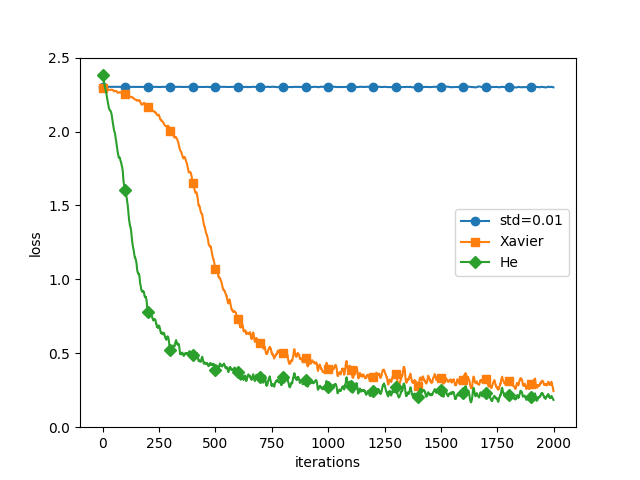

## ch6 與學習有關的技巧
1. 找最佳參數的手法。更新參數: SGD, Momentum, AdaGrad, Adam   
2. 權重參數的預設值。ReLU-He預設值, sigmoid&tanh-Xavier, st 隱藏層的活性化分布平均些    
3. batch normalization     
4. weight decay & dropout 等正規化手法, 當作過度學習的解決對策.    
5. 超參數最佳化的設定   
    

# 1. 更新參數(Optimization)     
神經網路的學習目的是, 盡量縮小損失函數的參數, 
- Before: 計算參數的梯度(微分), 往梯度方向更新參數, 逐漸趨近最佳參數. 稱為 *Stochastic Gradient Descent* (SGD).   
蒙著眼走, 只要朝著目前地面最傾斜的地方前進, 遲早有天可以到達深淵.    
- 這方法相當單純, 但還有更聰明的方法...
- 深度學習框架中, 包含了各種最佳化手法, 能輕鬆切換結構.   
> optimizer.py/class-SGD   

* 當函數是沒有等向性, 非延伸形狀的函數, 就會以沒有效率的路徑進行探索. (ie.梯度方向根本不是指向最小值)    
* Momentum, AdaGrad, Adam等取代SGD的手法.    

**1.1 Momentum**   
* Momentum(運動量): 物體往梯度方向受力, 並將這力量加速度, 可以想像成球在地面滾動的狀態.    
> optimizer.py/class-Momentum    
* x軸方向受力小, 但承受的施力為同方向, 所以會固定往相同方向加速。相對來說, y軸方向受力較大, 卻因為正負方向抵銷, 使得y軸方向的速度不穩定.    
與SGD相比, 比較快接近x軸方向, 可以減少起伏程度.   

**1.2 AdaGrad**   
* 學習率太小, 會花費很多時間在學習上；學習率太大, 會向外擴無法學習.   
隨著學習過程逐漸縮小學習率, 稱為 *學習率衰減(learning rate decay)*     
* 逐漸降低學習率, AdaGrad(Adative gradient)是適應各參數的元素, 一邊調整學習率, 一邊學習的手法.     
* AdaGrad是把過去的梯度當作平方和, 全都記錄下來. 因此在不斷學習下, 更新幅度會變小. 實際上, 無限學習下, 更新量會變小.    
:japanese_goblin: RMSProp, 是逐漸忘記過去梯度, 以大幅反應新梯度資料加總.        
> optimizer.py/class-AdaGrad     
* 最後一行加上小數值 1e-7, 是為了避免self.h[key]出現0, 發生除以0.   
* 剛開始會大幅移動, 根據大幅移動比例, 縮小更新步驟.   

**1.3 Adam**    
* Momentum是依照球在碗內來回滾動的物理定律移動, 而AdaGrad是依照各種參數元素, 調整適應的更新步驟。將兩手法融合, 便是Adam手法的基本雛形.    
> optimizer.py/class-Adam    
* 使用Adam的更新過程就像在碗內滾動般移動, 與Momentum動作相似, 但減少了左右搖晃的幅度, 這是因為Adam可以適應調整學習的更新程度.   

**1.4 比較更新手法**
* 使用不同方法會以不同路徑更新,   
* 並沒有一種手法能完美解決所有問題, 有各自擅長與不擅長解決的問題   
> optimizer_compare_naive.py   
> optimizer_compare_mnist.py   
* 以5層神經網路, 各層擁有100個神經元, 活化函數為ReLU.   
* 使用MNIST資料集比較四種手法, 另三種皆比SGD學習速度快, 而AdaGrad的學習速度稍微快一些.   
* 實驗結果會受 超參數-學習率, 網路結構-深度有幾層, 而產生變化.   

| comparison| itr- loss |
| :---: | :---: |
|| |
 
* 與SGD相比, 其他三種手法的學習速度的確較快, 有時辨識效能也較好.   


# 2. 權重的預設值
* 透過weight decay(權重衰減), 縮小權重值, 避免過度學習.    
* 將權重設為0, 權重為均一值, 需要隨機的預設值, 以破壞權重的對稱結果.   
* 觀察隱藏層的活化層(activation)分布, 隨著權重預設值產生何種變化. 在五層神經網路中, 傳遞隨機產生的輸入資料, 利用分布圖繪製各層的活化資料分布.   
> weight_init_activation.py   

```py
input_data = np.random.randn(1000, 100)  # 1000筆資料
node_num = 100  # 隱藏層截點數量
hidden_layer_size = 5  # 隠藏層有5層
activations = {}  # 儲存activation的結果

for i in range(hidden_layer_size):
    if i != 0:
        x = activations[i-1]

# 隨機生成權重值進行實驗   
    w = np.random.randn(node_num, node_num) * 1
    # w = np.random.randn(node_num, node_num) * 0.01
    # w = np.random.randn(node_num, node_num) * np.sqrt(1.0 / node_num)  #Xavier預設值  
    # w = np.random.randn(node_num, node_num) * np.sqrt(2.0 / node_num)  #He預設值

    a = np.dot(x, w)
    z = sigmoid(a)
    # z = ReLU(a)
    # z = tanh(a)

    activations[i] = z
```
活化函數-sigmoid    
* 5層且有100個神經元的神經網路, 活化函數-sigmoid, 隨機生成1000筆作為輸入資料, 傳遞給5層神經網路, 各層的activation儲存於activations變數中    
1. 當w=標準差1的常態分佈, 輸出activation分布偏向0與1, 該微分值也會趨近於0. 因此, 在偏向0或1的資料分布中, 反向傳播的梯度值會逐漸變小, 即發生 *梯度消失(gradient vanishing)* 問題.    
:scream_cat: 在層數較多的深度學習中, 梯度消失會造成嚴重的問題    
2. 當w=標準差0.1的常態分佈, 沒有引發梯度消失, 但出現了特定偏差, 多數的神經元輸出幾乎是一樣的數值.    
:scream_cat: 各層activation的分佈, 需擁有適當的廣泛度, 傳遞適當多樣性資料, 才能有效進行神經網路學習.        
3. *Xavier預設值*, 愈往上層會變成略為不規則的形狀, 但與前一層相比 分布較廣, 由於各層傳遞的資料有著適當的廣度, sigmoid函數的表現力沒受限制, 能有效學習.   
:scream_cat: 這裡的不規則形狀可以用tanh函數取代, 使用tanh函數能形成整齊的常態分佈.   
tanh與sigmoid函數一樣, 都是呈現s型曲線函數, tanh在原點(0, 0)呈對稱的s型, sigmoid在(0, 0.5)呈對稱的s型. 一般而言, 活化函數使用的函數最好擁有原點對稱的性質.     


活化函數-ReLU    
* Xavier預設值是在活化函數是線性的前提下, 所導出的結果. 而sigmoid, tanh是在中央附近左右對稱的線性函數, 所以很適合Xavier預設值.    
:scream_cat: 然而在使用ReLU時, 最好使用ReLU專用的預設值, 即 *He預設值*. 負領域變成0, 為了變得更廣泛, 需要加倍的係數.   
1. 當w=標準差0.1的常態分佈, 各層activation變得非常小, 在網路間傳遞非常小得資料, 表示反向傳播時, 權重梯度也會同樣變小, 導致無法繼續學習.    
2. 當w=Xavier預設值, 隨著層數加深, activation偏差愈大, 使得學習出現梯度消失的問題.    
3. 當w=He預設值, 讓各層分布的廣度變均勻, 即便層數變深, 資料廣度仍保持均一, 使得反向傳播時, 也能傳遞適當的值.   


利用MNIST資料集比較權重預設值    
> weight_init_compare.py    
* 比較"std=0.01", "Xavier預設值", "He預設值"進行實驗.   
* "std=0.01"完全不學習, "Xavier預設值", "He預設值"可順利學習, 但"He預設值"的學習速度較快.    
* 權重預設值影響神經網路學習成功與否, 只要妥善設定權重的預設值, 就能讓各層的activation分布具有適當的廣度, 順利學習.     
    


# 3. Batch Normalization(Batch Norm)-2015    
* 只要妥善設定權重的預設值, 就能讓各層的activation分布具有適當的廣度, 順利學習. 與其為了讓各層擁有適當的廣度, 不如強制調整activation分布.       
* Batch Norm 具有以下優點: 可快速學習(因為增加學習率), 不過度依賴預設值(不會對預設值產生過度反應), 控制過度學習(減少dropout等必要性).    
* 把batch norm層插入神經網路中, 在學習過程中, 以小批次為單位, 依照小批次進行正規化(讓資料分布平均為0, 分散為1的正規化處理.) 在活化函數前後加入batch norm, 可以減少資料分布的偏差.     

> batch_norm_test.py    
* 使用MNIST檢視使用batch norm層前後, 學習速度的變化. batch norm提升了學習速度   
* 設置不同權重預設值, 在使用batch norm後, 學習速度皆有提升. 
batch norm不僅可以促進學習速度, 權重預設值亦會變得更為穩健, 較不會過度依賴預設值.       


# 4. 正規化- weight decay, dropout 
* 設計複雜且表現力高的模型, 降低過度學習   
造成過度學習的原因: a.擁有大量參數且表現力高的模型, b.訓練資料太少    

> overfit_weight_decay.py  
* 減少訓練集(從60,000減為300個), 提高網路複雜度(7層網路, 每層網路100個), 活化函數ReLU    
* 按照每epoch, 分別計算 訓練資料 與 測試資料 的辨識準確度, (train_acc_list, test_acc_test).     
計算出的辨識準確度, 超過100 epoch後 幾乎是100%, 而測試資料與辨識準確度有很大的差距, 是為過度適應訓練資料的結果.        

```py
# 為了製造過度學習而減少學習資料
x_train = x_train[:300]
t_train = t_train[:300]

# weight_decay_lambda = 0 
weight_decay_lambda = 0.1
```

* 以weight decay 控制過度學習, 在學習過程中, 針對擁有較大權重的部分課以罰金. (過度學習就是權重參數太大...) 
* 神經網路的學習以減少損失函數為目的     
=> 權重的平方範數(L2-norm)與損失函數相加, 可以抑制權重變大.   
假設權重W, L2-norm的weight decay是 1/2 * lamda * W^2, here lamda is 控制正規化強度的超參數.   
lamda愈大, 會對取得的大權重值, 課以較重的罰金.   
1/2是為了把微分結果變成 lamda*W 的調整用定數.   

> overfit_dropout.py
* 當神經網路的模型變複雜時, 單憑weight decay, 很難解決過度學習問題.   
* Dropout是一邊隨機消除神經元, 一邊學習的手法.       
訓練時, 傳遞時, 會隨機挑選(隱藏層)刪除的神經元；     
測試時, 會傳遞全部的神經元訊號, 但各神經元的輸出, 要乘上訓練時刪除的神經元, 再傳遞.   

```py
self.mask = np.random.rand(*x.shape) > self.dropout_ratio   
```
* 正向傳播時, 把刪除的神經元當作false儲存在self.mask中, self.mask是隨機產生與x相同形狀的陣列, 只有這個值比dropout_ratio大的元素當作true. 在正向傳播時, 沒有通過訊號的神經元, 在反向傳播時, 訊號會就此停住.    
* 學習時, dropout隨機刪除神經元, 解釋成每次學習不同模型.    
推論時, 針對神經元的輸出, 乘上刪除比例, 取出模型的平均值. 換句話說, 可以把dropout視為用一個神經網路, 達到與整體學習(ensemble learning) 的效果.    


# 5. 驗證超參數(hyper-parameter)       
* 超參數是指: 各層的神經元數量, 批次大小batch, 參數更新的學習率lr, weight decay...    
* 不可以使用測試資料評估超參數效能, 需以驗證資料(validation data)    

```py
(x_train, t_train), (x_test, t_test) = load_mnist(normalize=True)
x_train, t_train = shuffle_dataset(x_train, t_train)  #混合訓練資料, common/util.py

#分別驗證資料
validation_rate = 0.20
validation_num = int(x_train.shape[0] * validation_rate)

x_val = x_train[:validation_num]
t_val = t_train[:validation_num]
x_train = x_train[validation_num:]
t_train = t_train[validation_num:]
```

**超參數的最佳化**    
* 關鍵在於: 逐漸縮小"優良"超參數的範圍. 隨機選出超參數(取樣), 利用樣本值評估辨識準確度. 反負ˋ數次後, 觀察辨識準確度的結果.      
在超參數最佳化過程, 縮小學習用的循環周期epoch, 能有效縮短每次評估所需的時間.    
進行超參數最佳化時, 如果希望採取更精煉的手法, 可以使用 Bayesian Optimization.    

> hyperparameter_optimization.py   
```py
# hyper-par 測試範圍
weight_decay = 10 ** np.random.uniform(-8, -4)
lr = 10 ** np.random.uniform(-6, -2)
```
* 隨機取樣, 再使用該值進行學習, 後續以各種超參數反覆進行學習, 觀察優良的超參數位於何處.   
* 觀察best1~best5, 順利學習的範圍: lr=0.001~0.01；weight decay=10^-8~10^-6,    
逐漸縮小超參數範圍, 最後挑選最後的超參數值.    

=========== Hyper-Parameter Optimization Result ===========       
Best-1(val acc:0.82) | lr:0.008414045473405648, weight decay:2.724528337909996e-07    
Best-2(val acc:0.79) | lr:0.007930400628154869, weight decay:1.213357878149684e-08    
Best-3(val acc:0.77) | lr:0.00638051196467228, weight decay:1.9296049856882277e-05    
Best-4(val acc:0.7) | lr:0.005466233814588296, weight decay:6.651732039937943e-07    
Best-5(val acc:0.69) | lr:0.005256947240579147, weight decay:8.707975567414897e-07      
