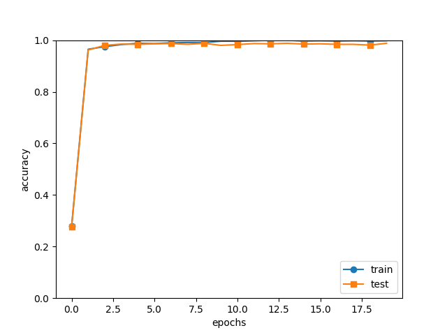
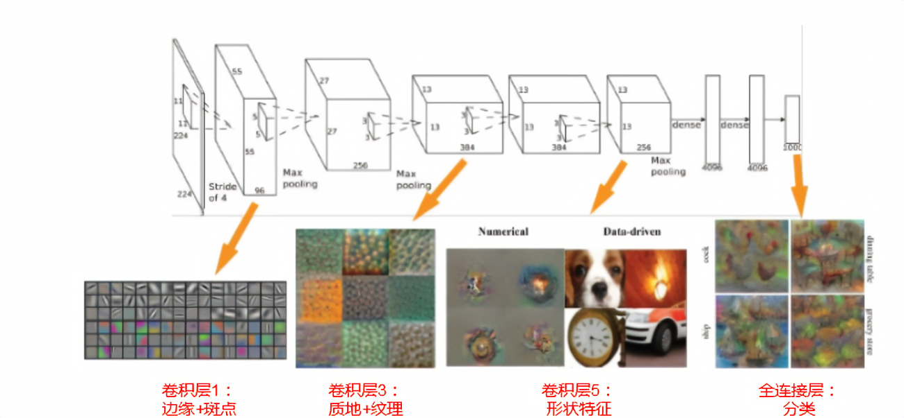
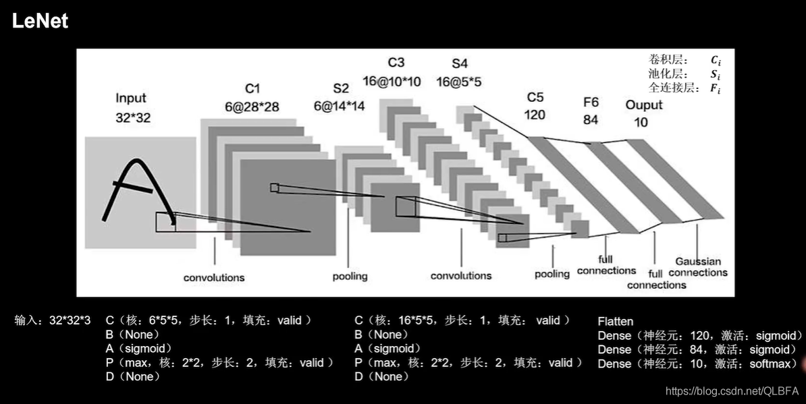
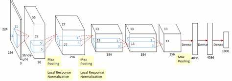

## ch7 convolutional neural network (CNN)   
* 主要運用於: 影像辨識, 聲音辨識...   
在視覺辨識競賽中, 深度學習使用的手法幾乎都是以CNN為基礎.   

7.2 卷積層     
7.3 池化層     
7.4 執行卷積層與池化層    
7.5 執行CNN    
7.6 CNN的視覺化   
7.7 代表性的CNN       


# Overall    
除了像神經網路, 可以組合各層來建構, CNN中還出現了新的「*Convolution layer(卷積層)*」,「*Pooling layer(池化層)*」.    
:skull: 全連接層會忽略資料的形狀, 影像通常有水平、垂直、色版方向的三維形狀, 然而輸入全連接層時, 三維資料必須變成平面, 即變成一維資料.    
* 如: MNIST輸入影像為(1,28,28), 1色版 垂直28像素 水平28像素的形狀, 全連接層轉成784個資料, 輸入affine layer.     
* 形狀包含重要的空間資料, 類似空間有著相似的像素值, RGB各色版兼具有緊密連接的關聯性, 距離較遠的像素彼此沒有關係等.     
* 而卷積層能維持形狀, 輸入資料為三維資料, 有時會把CNN的卷積層輸出入資料稱為*特徵圖(feature map)*, #input feature map, output feature map   

# 7.2 卷積運算   
卷積運算在輸入資料套用濾鏡, 部分文獻把濾鏡稱為「*核(kernal)*」     
- 輸入資料是擁有垂直、水平方向形狀的資料,     
- 濾鏡也同樣擁有垂直、水平方向的維度, 資料與濾鏡的形狀以(height, width)顯示    
- 在各個位置乘上kernal的元素與對應輸入的元素, 並計算總和(稱為積和運算), 再將結果儲存在對應輸出的位置. 乘上權重, 加上偏權值.      

@@   
1. *填補(padding)*: 在輸入資料的周圍填上固定資料, 寬度1的填滿, 周圍用寬1像素的0填滿.    
填補的目的是為了調整輸出大小, 若沒有填補, 在反覆運算後空間會縮小, 最後輸出變成1. 將填補寬度設為1, 輸入為(4,4), 輸出也保持(4,4). 因此藉由卷積運算, 維持固定空間, 將資料傳遞給下一層.   
2. *步幅(stride)*: 步幅變大, 輸出大小會變小；填補變大, 輸出大小會變大.   
* 輸入大小(H,W), 濾鏡大小(FH,FW), 輸出大小(OH,OW), 填補P, 步幅S.   

## 三維資料的卷積運算
在深度方向(色版方向)增加了特徵圖, 如果色版方向多了特徵圖時, 要依照各個色版進行輸入資料與濾鏡的卷積運算, 將結果相加 獲得一個輸出.   
* #輸入資料 = #色版, 濾鏡大小可隨意設定, 但每個色版大小需一樣    
* 三維資料(channel, height, width)=(色版數C, 高度H, 寬度W)    
* (色版數C, 濾鏡高度filter height, 寬度filter width)=(C, FH, FW)   

:honeybee: input data(C, H, W) * filter(C, FH, FW) = output data (1, OH, OW)   

* 套用FN個濾鏡, 也會產生FN個輸出特徵圖, 完成形狀為(FN, FH, OW)   

:honeybee: input data(C, H, W) * filter(FN, C, FH, FW) = output data (FN, OH, OW)  

* 把輸入資料整合成一束的*批次處理*, 提高運算效率. 把流動在各層的資料儲存成四維資料, 具體來說是依照(batch_num, channel, height, width)的順序來儲存資料. 把N個資料進行卷積, 一次執行完N次處理.     

# 7.3 池化層
特色:    
- 沒有學習參數: 在目標區域曲最大值(或平均值), 沒有必須學習的參數.    
- 色版數量不變: input與outout的色版數量不會隨池化運算而改變, 各個色版獨立運算.    
- 對微小位置變化很穩健(robust): 即使input出現小偏差, 池化仍會回傳相同結果, 因此對input的微小偏差很穩健, 假設有個3*3的池化, 池化會吸收掉input的偏差(部分資料可能出現不一致).   


# 7.4 執行卷積層/池化層    

```py
# 4-dims array  
x = np.random.rand(10,1,28,28)
x.shape
x[0].shape  #(1,28,28) 存取第1個資料
x[0][0]     #存取第1個資料的第1色版空間

# im2col: image to column, 將影像轉換為陣列  
# 針對套用的濾鏡, 展開輸入資料. 對三維輸入資料, 套用im2col, 會轉成二維陣列
# 先將陣列運算最佳化, 再快速執行大型陣列的乘法運算.   
# def col2im(col, input_shape, filter_h, filter_w, stride=1, pad=0)   

import sys, os
sys.path.append(os.pardir)
from common.util import im2col
import numpy as np


x1 = np.random.rand(1, 3, 7, 7)
col1 = im2col(x1, 5, 5, stride=1, pad=0)
print(col1.shape)

x2 = np.random.rand(10, 3, 7, 7)  #10筆資料
col2 = im2col(x2, 5, 5, stride=1, pad=0)
print(col2.shape)

```

> 卷積層: common/layers.py   
* 初始化: 把濾鏡, 偏權值, stride, padding 作為引數取得      
* reshape 可以整合元素數量, 使多維陣列的元素數量完美配合, 原(10, 3, 5, 5)全部元素數量為750個, 假設reshape(10, -1), 就能調整成形狀為(10,75)的陣列.     
* forward/transpose 更換多維陣列各軸順序的函數, 設定從0開始的索引值, 更換軸的順序.    

```py
# class Covolution: 

col = im2col(x, FH, FW, self.stride, self.pad)
col_W = self.W.reshape(FN, -1).T  #展開濾鏡
out = np.dot(col, col_W) + self.b
```
> 池化層: common/layers.py    
* forward 展開輸入資料, 計算每列的最大值, 調整成適當的輸出大小. 將輸入資料展開成容易執行池化的形狀, 後續處理會簡單很多.       
* backward ReLU-max反向傳播      

# 7.5 執行CNN   
> simple_convnet.py   
> train_convnet.py   
* 利用SimpleConvNet學習MNIST資料集後, 訓練資料的辨識率為 99.82%, 測試資料的辨識率為 98.96%, 對於小網路而言, 辨識率算是非常高.      

    

# 7.6 CNN的視覺化  

**視覺化第一層權重**  
  
使用CNN的卷積層可以看到甚麼?    
> visualize_filter.py   

* 由於學習前的濾鏡進行了隨機初始化, 所以黑白深淺沒有規則性, 然而學習結束後, 更新成了有規則的濾鏡, 包括由白到黑漸層變化的濾鏡、具有塊狀區域(blob)的濾鏡等.   
* 邊界(顏色變化的邊緣), 塊狀(局部塊狀區域)等. 卷積層的濾鏡, 可以截取邊界與塊狀等原始資料, 把這種原始資料傳遞給下一層.      
     
**利用階層結構截取資料**      
* 隨著層數加深, 擷取的資料(反應強烈的神經元)會變得更抽象化.    
最初的層級反應單純的邊界、紋理、複雜的物體部位, 從單純的形狀變成高階的資料, 就像瞭解物體的意義般.          
    


# 7.7 代表性的CNN  

## 1998- LeNet     
手寫數字辨識, 連續執行卷積層與池化層, 最後透過全連接層輸出結果.    

| | LeNet | Present CNN |      
|:----:|:----:|:----:|     
| 活化函數 | Sigmoid | ReLU為主 |     
| 利用...縮小中間資料的大小 | 次取像(subsampling) | 以最大池化為主 |     

    

    
## 2012- AlexNet    
LeNet問世後, 過了近20幾年, 才提出AlexNet, 是為深度學習的先驅者.       
AlexNet: 重疊數層卷積層與池化層, 最後經由全連接層輸出結果.    

* 結構與LeNet大同小異     

以下相異點:     
* 使用 ReLU 活性函數    
* 使用 LRN(Local Response Normalization) 局部性正規化層     
* 使用 Dropout      

    


另外, 電腦技術有顯著進步, GPU普及, 使能平行運算 高速進行大量運算.    
深度學習(多層網路)通常有許多參數, 因此學習時需要大量運算, 且需要滿足這些參數的龐大資料. 因此GPU與大數據成為推動深度學習發展的原動力.    


## 經典卷積網路     
> DAbasic_sortout/Tensorflow2/深度学习与TensorFlow入门实战-源码和PPT/10 卷積神經網絡/lesson41-经典卷积网络/    

2010 shallow: ILSVRC10, ILSVRC11     
2012 8Layers: ILSVRC12- AlexNet :star: (準確率提升了10多個%)     
2013 8Layers: ILSVRC13-ZFNet (準確率再提升)     
2014 19Layers: ILSVRC14-VGG     
2014 22Layers: ILSVRC14- GoogleNet :star:      
152Layers: ILSVRC15- ResNet :star:         


**本章學習到的重點**     
- CNN在全連接層的網路中, 新加入了卷積層與池化層.    
- 使用im2col(將影像展開成陣列的函數), 即可輕鬆快速執行卷積層與活化層.    
- 將CNN視覺化, 可以了解加深層數後, 截取出的高階資料模樣.    
- CNN代表網路包括 LeNet與AlexNet.    
- 大數據與GPU對深度學習發展有重大貢獻.    

